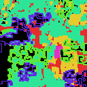
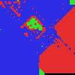
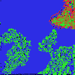
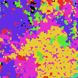

# Population-Based Training of Petri Dish Neural Cellular Automata (PBT-NCA)

<p align="center">
  
</p>

**Website:** [arberzela.github.io/pbt-nca](https://arberzela.github.io/pbt-nca/)

PBT-NCA is a meta-optimization framework for **Petri Dish Neural Cellular Automata (PD-NCAs)** that turns population-based training into an open-ended discovery process. Instead of optimizing a stationary objective, it applies **novelty-driven selection pressure at two timescales** so that populations of competitive worlds keep producing new behaviors and structures over long horizons.

## 💡 Method in brief

At each meta-iteration, PBT-NCA:

1. **Rolls out and scores** a population of worlds in which multiple NCA agents compete on a shared grid.
2. **Updates a FIFO archive** of behavioral descriptors and rewards novelty relative to past discoveries.
3. **Adds visual diversity** using frozen DINOv2 features to favor new morphologies, not just handcrafted statistics.
4. **Performs exploit–explore replacement**, where weak worlds are replaced by mutated/crossed-over copies of stronger ones.

This produces emergent phenomena such as gliders, shooters, amoebas, colonies, and other lifelike dynamics without manually specifying target behaviors.

## ✨ Selected emergent dynamics

_Click any GIF to open it directly._

<!-- markdownlint-disable MD033 -->
<table>
  <tr>
    <td valign="top" width="33%">
      <strong>Amoeba</strong><br>
      <a href="gifs/amoeba.gif"></a><br>
      Fluid, shape-shifting macro-structures with coordinated movement.
    </td>
    <td valign="top" width="33%">
      <strong>Glider</strong><br>
      <a href="gifs/glider.gif"></a><br>
      Persistent traveling waves that self-propagate across the grid.
    </td>
    <td valign="top" width="33%">
      <strong>Shooter</strong><br>
      <a href="gifs/shooter.gif"></a><br>
      Stable territorial clusters that emit projectile-like structures.
    </td>
  </tr>
  <tr>
    <td valign="top" width="33%">
      <strong>Ant Colony</strong><br>
      <a href="gifs/ants.gif"></a><br>
      Decentralized, trail-like coordination emerging from local interaction rules.
    </td>
    <td valign="top" width="33%">
      <strong>Colony</strong><br>
      <a href="gifs/colony.gif"></a><br>
      Distributed territorial clusters with distant colonization.
    </td>
    <td valign="top" width="33%">
      <strong>Motherboard</strong><br>
      <a href="gifs/spaceship_motherboard.gif"></a><br>
      Highly structured replicating entities with intricate internal substructure.
    </td>
  </tr>
  <tr>
    <td valign="top" width="33%">
      <strong>JAXLife Dynamics</strong><br>
      <a href="gifs/jaxlife.gif"></a><br>
      Large-scale simulation dynamics resembling JAXLife.
    </td>
    <td valign="top" width="33%">
      <strong>Spiral Waves</strong><br>
      <a href="gifs/spirals.gif"></a><br>
      Rotating wavefronts and cyclic spatial organization emerging over time.
    </td>
    <td valign="top" width="33%">
      <strong>Open-Ended Rollout</strong><br>
      <a href="gifs/pdnca2.gif"></a><br>
      Multiple shapes and dynamics emerging in a single substrate.
    </td>
  </tr>
</table>
<!-- markdownlint-enable MD033 -->

## 📦 Installation

Install [uv](https://docs.astral.sh/uv/) (Python package manager):

```bash
curl -LsSf https://astral.sh/uv/install.sh | sh
```

Clone and install:

```bash
git clone https://github.com/arberzela/pbt-nca
cd pbt-nca
uv sync
```

This project requires Python 3.11. The `.python-version` file pins this automatically when using `uv`.

**On a GPU cluster**, upgrade the PyTorch install to a CUDA build after `uv sync`:

```bash
bash scripts/ensure_cuda_torch.sh .venv/bin/python
```

The SLURM scripts call this automatically before each job.

## 🚀 Quick start

```bash
# Basic run (CPU, no WandB)
uv run python src/train.py --n-ncas 3 --epochs 1000 --device cpu

# Run with a config file
uv run python src/train.py --config configs/example.json

# PBT (small, CPU)
uv run python src/train.py --config configs/pbt-tiny.json --pbt

# Random-resampling baseline
uv run python src/rs.py --config configs/pbt-tiny.json
```

## 🔬 Reproducing Paper Experiments

All paper experiments are run via SLURM job arrays in `scripts/`. Each script submits 3 independent
seeds (`--array=0-2`) using the config in `configs/slurm_h100_pbt_scale_small.json`.

### Prerequisites

Export the required variables before submitting. You can also set them in your cluster's environment
or in a submission wrapper script.

```bash
export REPO_DIR="$HOME/pbt-nca"           # path to this cloned repo
export SCRATCH_DIR="$HOME/scratch"         # scratch space for logs and caches

export WANDB_PROJECT="pbt-nca"             # your W&B project name
export WANDB_ENTITY="your-wandb-entity"    # your W&B username or team

# Required only for DINOv2 / VLM experiments:
export HF_TOKEN="hf_..."
```

Update the `#SBATCH --partition=workq` line in each script to match your cluster's partition name.

Scripts must be submitted from the **repository root** (so that relative paths like `configs/` and
`src/` resolve correctly):

```bash
cd $REPO_DIR
sbatch scripts/paper_pbt_combined_median_3seeds.sbatch
```

### Experiment table

| Script | Experiment | Selection method |
|--------|-----------|-----------------|
| `paper_pbt_combined_median_3seeds.sbatch` | PBT (Combined Median) | Novelty + DINOv2 cosine median, combined |
| `paper_pbt_dino_median_3seeds.sbatch` | PBT (DINOv2 Median) | DINOv2 cosine median ranking |
| `paper_pbt_dino_elo_3seeds.sbatch` | PBT (DINOv2 ELO) | DINOv2 cosine ELO tournament |
| `paper_pbt_vlm_prompt_3seeds.sbatch` | PBT (VLM Prompt) | VLM prompt-guided selection (CLIP) |
| `paper_pbt_handcrafted_3seeds.sbatch` | PBT (Handcrafted) | Handcrafted behavioral descriptors |
| `paper_rs_baseline_3seeds.sbatch` | Random Resampling | No selection; uniform hyperparameter resampling |
| `paper_pd_nca_baseline_3seeds.sbatch` | PD-NCA Baseline | No PBT; single model, compute-matched budget |

The **PD-NCA baseline** trains a single model for `epochs × pbt_population_size × pbt_meta_iterations`
steps, matching the total compute budget of a full PBT run.

The **random resampling baseline** keeps the PBT population infrastructure but removes fitness-based
selection, isolating the contribution of selection pressure.

### Resource profile

Each job requests: 1 GPU · 8 CPUs · 300 GB RAM · 24 h wall time. The scripts were tuned for H100
GPUs. Adjust `--mem` and `--time` as needed for your hardware.

## ⚙️ Configuration

Paper experiments use `configs/slurm_h100_pbt_scale_small.json` as the base config.

| Config | Purpose |
|--------|---------|
| `slurm_h100_pbt_scale_small.json` | Full-scale paper experiments (128×128 grid, PBT) |
| `slurm_h100_pbt_scale.json` | Larger-scale variant (256×256 grid) |
| `slurm_h100_pdnca_scale_small.json` | Baseline PD-NCA config (no PBT) |
| `example.json` | Example config for local/interactive runs |
| `tiny-config.json` | Minimal config for quick CPU testing (no PBT) |
| `pbt-tiny.json` | Minimal PBT config for quick CPU testing |
| `pbt-interesting.json` | Mid-scale interactive PBT config |

Any parameter not specified in a config defaults to the values in `src/config.py`.

Key PBT parameters:

- `pbt_population_size`, `pbt_meta_iterations`, `pbt_world_horizon` — population size and schedule
- `pbt_inheritance_mode` — `"lamarck"` (inherit trained weights on exploit) or `"darwin"` (reset on exploit)
- `pbt_vlm_enabled`, `pbt_vlm_model_id` — enable VLM-based descriptor scoring
- `pbt_use_median_ranking`, `pbt_use_elo_ranking`, `pbt_use_combined_median` — ranking strategy

## 📝 Citation

If you use this project, please cite:

```bibtex
@inproceedings{berdica2026pbtnca,
  title     = {Evolving Many Worlds: Towards Open-Ended Discovery in Petri Dish NCA via Population-Based Training},
  author    = {Berdica, Uljad and Foerster, Jakob and Hutter, Frank and Zela, Arber},
  booktitle = {TODO: add venue},
  year      = {2026}
}
```
