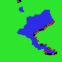
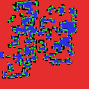
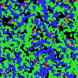

# Population-Based Training of Petri Dish Neural Cellular Automata (PBT-NCA)

**Website:** [arberzela.github.io/pbt-nca](https://arberzela.github.io/pbt-nca/)

PBT-NCA is a meta-optimization framework for **Petri Dish Neural Cellular Automata (PD-NCAs)** that turns population-based training into an open-ended discovery process. Instead of optimizing a stationary objective, it applies **novelty-driven selection pressure at two timescales** so that populations of competitive worlds keep producing new behaviors and structures over long horizons.

## Method in brief

At each meta-iteration, PBT-NCA:

1. **Rolls out and scores** a population of worlds in which multiple NCA agents compete on a shared grid.
2. **Updates a FIFO archive** of behavioral descriptors and rewards novelty relative to past discoveries.
3. **Adds visual diversity** using frozen DINOv2 features to favor new morphologies, not just handcrafted statistics.
4. **Performs exploit–explore replacement**, where weak worlds are replaced by mutated/crossed-over copies of stronger ones.

This produces emergent phenomena such as gliders, shooters, amoebas, colonies, and other lifelike dynamics without manually specifying target behaviors.

## Selected emergent dynamics

_Click any GIF to open it directly._

<!-- markdownlint-disable MD033 -->
<table>
  <tr>
    <td valign="top" width="33%">
      <strong>Amoeba</strong><br>
      <a href="website/gifs/amoeba.gif"></a><br>
      Fluid, shape-shifting macro-structures with coordinated movement.
    </td>
    <td valign="top" width="33%">
      <strong>Glider</strong><br>
      <a href="website/gifs/glider.gif"></a><br>
      Persistent traveling waves that self-propagate across the grid.
    </td>
    <td valign="top" width="33%">
      <strong>Shooter</strong><br>
      <a href="website/gifs/shooter.gif"></a><br>
      Stable territorial clusters that emit projectile-like structures.
    </td>
  </tr>
  <tr>
    <td valign="top" width="33%">
      <strong>Ant Colony</strong><br>
      <a href="website/gifs/ants.gif"></a><br>
      Decentralized, trail-like coordination emerging from local interaction rules.
    </td>
    <td valign="top" width="33%">
      <strong>Colony</strong><br>
      <a href="website/gifs/colony.gif"></a><br>
      Distributed territorial clusters with distant colonization.
    </td>
    <td valign="top" width="33%">
      <strong>Motherboard</strong><br>
      <a href="website/gifs/spaceship_motherboard.gif"></a><br>
      Highly structured replicating entities with intricate internal substructure.
    </td>
  </tr>
  <tr>
    <td valign="top" width="33%">
      <strong>JAXLife Dynamics</strong><br>
      <a href="website/gifs/jaxlife.gif"></a><br>
      Large-scale simulation dynamics resembling JAXLife.
    </td>
    <td valign="top" width="33%">
      <strong>Spiral Waves</strong><br>
      <a href="website/gifs/spirals.gif"></a><br>
      Rotating wavefronts and cyclic spatial organization emerging over time.
    </td>
    <td valign="top" width="33%">
      <strong>Open-Ended Rollout</strong><br>
      <a href="website/gifs/pdnca2.gif"></a><br>
      Multiple shapes and dynamics emerging in a single substrate.
    </td>
  </tr>
</table>
<!-- markdownlint-enable MD033 -->

## Citation

If you use this project, please cite:

```bibtex
@inproceedings{berdica2026pbtnca,
  title     = {Evolving Many Worlds: Towards Open-Ended Discovery in Petri Dish NCA via Population-Based Training},
  author    = {Berdica, Uljad and Foerster, Jakob and Hutter, Frank and Zela, Arber},
  year      = {2026}
}
```
